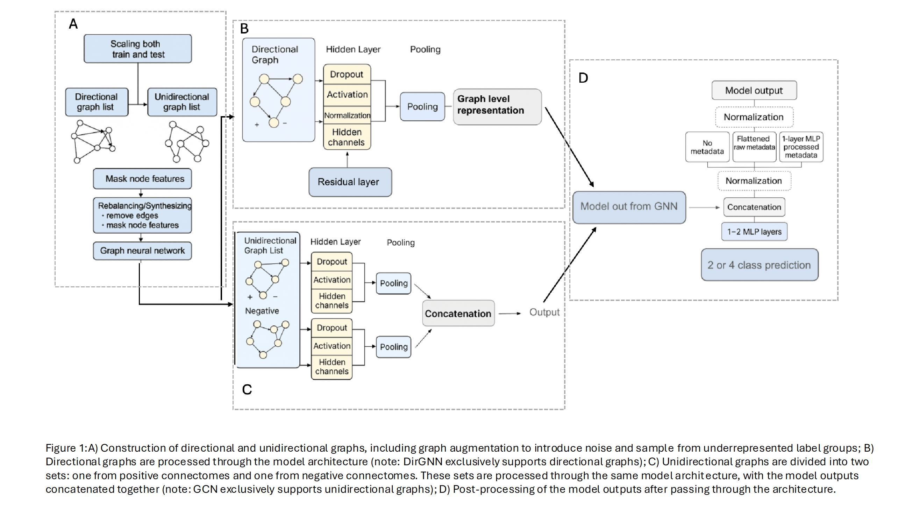

# fMRI-AHDH
Repo to document traditional ML models and Graph Neural Networks (GNN) built for for WiDS 2025, using fMRI connectome data and demographic data to predict sex-specific ADHD diagnosis. 

The repo demostrates ML models (MLprediction.py) and seven GNN model archiectures (GNNprediction.py). 

## 🚀 How about a Quick Start? 
### GNN Model Training
To run GNN models for training:
```bash
python GNNprediction.py --train_config config/train_config_[model_name].yaml 
```
Model specific parameters could be tested within the configuration. This repo contains 9 GNN model architectures, including:
1. **GCN** (Graph Convolutional Network)
2. **GATv2** (Graph Attention Network v2) 
3. **SageGNN** (GraphSAGE)
4. **TransConv** (Transformer Convolution)
5. **NNConv** (Neural Network Convolution)
6. **DirGNN** (Directional GNN)
7. **DirGNN_GatConv** (Ensemble of Directional GNN and GAT) 

### GNN Model Inference
For running inference on the test dataset:
```bash
python GNNprediction.py --test_config config/test_config.yaml # Need to change checkpoint pathway inside 
```

### Traditional ML Models
To run traditional ML models for training and testing:
```bash
python MLprediction.py --config config/train_config_ML.yaml 
```

**ML Model Training & Inference Modes:**
The traditional ML pipeline supports flexible training and inference modes controlled by configuration parameters:

- **Training + Inference Mode:** `training_enabled: True` and `run_inference_on_test: True`
  - Trains new models using cross-validation
  - Automatically runs inference on test data using best trained model
  - Saves both training results and test predictions

- **Inference Only Mode:** `training_enabled: False` and `run_inference_on_test: True`
  - Loads pre-trained model checkpoints
  - Runs inference on test data only
  - Requires existing model files and configurations

- **Training Only Mode:** `training_enabled: True` and `run_inference_on_test: False`
  - Trains and evaluates models using cross-validation
  - Saves trained models but skips test inference
  - Useful for model development and hyperparameter tuning 

## 📋 GNNprediction.py Scripts Documentation
**Purpose:** Main inference script for Graph Neural Network models. tLoads trained GNN models and performs prediction on test data. Below is a figure containing the overview of our major workflow: 
[View PDF Documentation](readme_image/GNN_explained.pdf)


**Key Features:**
- **Data Preprocessing Pipeline:** Comprehensive fMRI connectome data preprocessing and scaling with the following steps:
  1. _Missing Data Imputation:_ Uses KNN imputation to handle missing values (implementation in `src/data/KNN_imputer.py`)
  2. _Distribution Normalization:_ Applies Fisher-Z transformation to normalize training fMRI data to standard normal distribution, then uses Mean Standard Scaler for test dataset scaling (implementation in `src/data/scaling.py`)
  3. _Class Imbalance Handling:_ Implements custom graph augmentation techniques to generate additional graphs for underrepresented labels (implementation in `GNNprediction.py`)
  4. _Demographic Data_ Process and normalzie demographic data （`src/utility/ut_general.py`）

- **Graph Building:** Converts fMRI correlation matrices into graph-structured data for GNN processing:
  - **Graph Construction Methods:**
    - **Directional Graphs:** `create_graph_lst()` - Creates directed graphs preserving correlation sign and directionality. Directionality depends on the sign of fMRI connectomes (`Figure 1A, 1B`). 
    - **Undirectional Graphs:** `create_undirectional_graph_lst()` - Separates positive and negative correlations into distinct graphs. Two sets of graphs (positive connectome + negative connection) are built and passed through the same selected model archiecture. Model outputs are concatenated for downloadig FC processing and making final prediction (`Figure 1A, 1C`). 
  - **Graph Data Structure:**
    - **Node Features (x):** 200×200 tensor representing brain regions
    - **Edge Indices:** Source and target node pairs for connections
    - **Edge Attributes:** Correlation strengths between brain regions
    - **Labels (y):** ADHD/sex classification labels
    - **Metadata:** Participant IDs for tracking 

- **Model Training:** Trains GNN models based on selected architecture with fully configurable hyperparameters (`Figure 1B, 1C`):
  - _Architecture Parameters_:
    - Number of layers and hidden channels
    - Batch normalization and graph normalization options
    - Dropout rates for fully connected (FC) and GNN layers
  - _Pooling Options_:
    - Global pooling methods (Attention, Max, Average pooling)
    - Learnable attention-based pooling mechanisms
  - _Feature Integration_:
    - Metadata incorporation as flattened 81-dimensional vectors
    - Optional MLP preprocessing of demographic features
  - _Advanced Features_:
    - Residual connections in GNN architectures
    - Configurable activation functions (ReLU, LeakyReLU, GELU)
    - Model-specific parameters (alpha values for directional models, attention heads for attention-based models) 
  - _CV-based or model-based hyperparameters_:
    - K fold CV (Optionally, the script can train on the full training dataset)
    - Number of batch size per epoch 
    - Number of epochs and early stopping based on N epochs 
    - Learning rate scheduler and starting learning rate
    - Label smoothing 
    - Master seed for reproducibility 
  - _Final Prediction_: model outputs are concatenated with the three below options: 
    - Concatednated with Flattened normalized metadata 
    - Concatenated with 1 MLP processed metadata 
    - No concatenation with metadat  
  The final model output can also pass through normalization layer and 1-2 MLP laters to make final 2 class (adhd or sex) predictions or 4 class (adhd-sex dependent) predictions (`Figure 1D`). 

- **Traning result monitoring** Train/Validation accuracy and loss are all uploaded to weights and bias `wandb` for better visualization. 
- **Model Loading:** Automatically loads trained GNN models from checkpoint directories
- **Output Generation:** Saves predictions in standardized format for submission

**Input Data:**
- fMRI connectome correlation matrices (19,900 features per participant)
- Demographic metadata (age, sex, handedness, etc.)
- Trained model checkpoint files

**Output:**
- Prediction CSV files with participant IDs and predicted labels
- Confidence scores and model performance metrics
- Inference logs and processing statistics

**Supported GNN Architectures:**
1. **GCN** (Graph Convolutional Network)
   - _Architecture:_ Multi-layer spectral graph convolution
   - _Key Features:_ Normalized adjacency matrix, configurable normalization layers

2. **GATv2** (Graph Attention Network v2)
   - _Architecture_: Multi-head attention mechanism for node interactions
   - _Key Features_: Edge-aware attention, configurable attention heads
   - _Attention Pooling_: GlobalAttention with learnable gate networks
   - _Edge Dimensions_: Supports edge attributes (correlation strengths)

3. **SageGNN** (GraphSAGE)
   - _Architecture_: Sampling and aggregating from node neighborhoods
   - _Key Features_: Configurable aggregation functions (mean, max, LSTM)
   - _Normalization_: Optional L2 normalization of node embeddings

4. **TransConv** (Transformer Convolution)
   - _Architecture_: Self-attention mechanism adapted for graphs
   - _Key Features_: Multi-head attention, edge-aware transformations
   - _Aggregation_: Max aggregation across attention heads

5. **NNConv** (Neural Network Convolution)
   - _Architecture_:Edge-conditioned convolution with neural networks
   - _Key Features_: Edge-specific transformation functions
   - _Neural Networks_: Two-layer MLPs for edge weight processing

6. **DirGNN** (Directional GNN)
   - _Architecture_:Directional message passing for asymmetric graphs
   - _Key Features_: Alpha parameter for controlling directional influence
   - _Base Convolution_: Built on top of GCN layers

7. **DirGNN_GatConv** (Ensemble of Directional GNN and GAT)
   - _Architecture_:Hybrid model combining directional and attention mechanisms
   - _Key Features_: Parallel DirGNN and GATv2 branches
   - _Ensemble Method_: Concatenation of both branch outputs

##📋 MLprediction.py (Traditional ML Pipeline)
**Location:** `MLprediction.py`

**Purpose:** Traditional machine learning pipeline for fMRI-based ADHD and sex prediction using classical ML algorithms.

**Key Features:**
- _Multiple ML Models:_ RandomForest, GradientBoosting, AdaBoost, KNN, SVM, Logistic Regression
- _Feature Selection:_ Our configurations allow for choosing between three feature selection methods (`Figure2`): 
    - Mutual Information: Selects top-k features based on mutual information scores
    - Linear Discriminant Analysis (LDA): Dimensionality reduction for classification
    - Combined Features: fMRI connectome + demographic metadata
PS: Demographic data could be appeneded or not depending on user's choice. 
- _Class Imbalance Handling:_ SMOTE oversampling for balanced training (`Figure2`). 
- _Hyperparameter Optimization:_ Grid search with cross-validation. We pre-defined a parameter searching grid and the script will train based on the grid and selected model. 

**Supported ML Models:**
1. **RandomForest** - Ensemble of decision trees with feature bagging
2. **GradientBoosting** - Gradient boosting with configurable learning rates
3. **AdaBoost** - Adaptive boosting with decision tree base estimators
4. **KNN** - K-nearest neighbors with distance weighting
5. **SGDClassifier** - Stochastic gradient descent classifier
6. **LogisticRegression** - Regularized logistic regression
7. **SVM** - Support Vector Machine with RBF kernel
8. **NuSVC** - Nu-Support Vector Classifier

**Usage Example:**
```bash
python MLprediction.py --config config/train_config_ML.yaml
```
**Pipeline Overview** 
A basic pipeline for ML prediction is listed [View PDF Documentation](readme_image/TradML.pdf) 
[!fugure2_tradML_pipeline](readme_image/TradML.png) 

## 🔮 Future Direction 
It would be interesting to explore LLM and using the metadata alone to make prediction. We included a testing notebook `notebooks/test.ipynb` for LLM prompt buidling, although it is not finished. 

